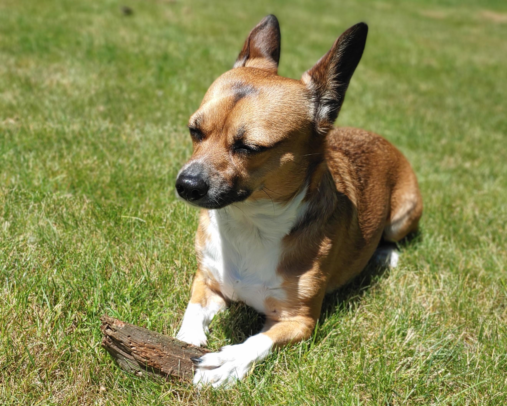

### Hi there, I'm Ishan. 👋
----
I'm a software engineer from Seattle, WA. 

This is my dog, Lucy. She loves the sun.
 
 
I have too many hobbies, including:
- 🔧 Working on cars
- 🎿 Skiing 
- ☕ Coffee 
- 🌄 Hiking 
- 🚵 Mountain biking 

<!--
**Ishan-Jaidka/Ishan-Jaidka** is a ✨ _special_ ✨ repository because its `README.md` (this file) appears on your GitHub profile.

Here are some ideas to get you started:

- 🔭 I’m currently working on ...
- 🌱 I’m currently learning ...
- 👯 I’m looking to collaborate on ...
- 🤔 I’m looking for help with ...
- 💬 Ask me about ...
- 📫 How to reach me: ...
- 😄 Pronouns: ...
- ⚡ Fun fact: ...
-->
